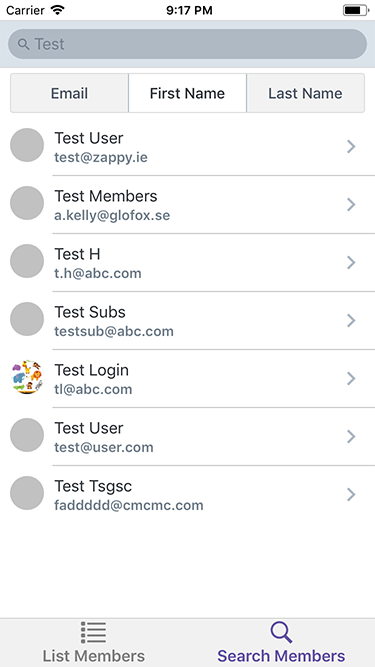

# Glofox Lazy Loading Test Application

This application is designed to fulfil the requirement of the Glofox dev test based [here](https://bitbucket.org/glofox/app-recruitment).
As an experiement I have, for the first time, userd React-native to create a cross platform app to fulfil the requiemnts of the task. 

 

## Setup

1. **Clone the repo**

  ```
  $ git clone https://github.com/fiachra/GlofoxMembers-RN
  $ cd GlofoxMembers-RN
  ```

2. **Install dependencies**:

  ```
  $ npm install
  ```

3. **Enviromental Setup**

If you have previously developed any React-native apps you can skip this step otherwise follw the instrctions laid out inder the "Building projects with Native code" tab that the following [link](https://facebook.github.io/react-native/docs/getting-started.html)

4. **Running on Android**:

  ```
  $ react-native run-android
  ```

5. **Running on iOS (macos only, XCode Required):**

  ```
  $ react-native run-ios
  ```
